# Outline

## {.smaller}

<!-- Note: En esta exposición no se hace recorrido cronológico de la formación de los artículos sino un recorrido sistemático del trabajo. -->

- Introduction
  - INLA
  - Dealing with high complexity

. . .

- Distributed and Recursive Inference
  - Distributed Inference (DI)
  - Recursive Inference (RI)
  - Differences and connections between DI and RI
  - Partitioning model structures
  - Combining recursive and distributed inference
  
. . .

- Examples
  - Spatio-temporal model for temperature data
  - Spatio-temporal downscaling model for CoDa
  
. . .

- Conclusions

# Introduction

## INLA

- INLA is an ad hoc method, focused on obtaining the marginal posterior distributions of the latent field ($x_i$) and the hyperparameters ($\theta_i$):

\begin{equation}
\begin{array}{c}
\pi(\theta_i \mid \mathbf{y}) = \int_{\boldsymbol\theta_{-i}\in \boldsymbol\Theta}\int_{\mathbf{x} \in \mathbf{X}} \pi(\mathbf{x}, \boldsymbol\theta \mid \mathbf{y}) d\mathbf{x}d\boldsymbol\theta_{-i}, \\
\pi(x_i \mid \mathbf{y}) = \int_{\boldsymbol\theta \in \boldsymbol\Theta} \int_{\mathbf{x}_{-i} \in \mathbf{X}} \pi(\mathbf{x}, \boldsymbol\theta \mid \mathbf{y}) d\mathbf{x}_{-i}d\boldsymbol\theta.
\end{array}
\end{equation}

- It is focused for hierarchical models with latent Gaussian fields. Therefore, we usually have the following structure for models in INLA:

\begin{equation}
\begin{array}{c}
y_i \mid \mathbf{x}, \boldsymbol\theta \sim \ell(\mu_i, \boldsymbol\theta_1),\\
\mathbb{E}(y_i) = \mu_i = g^{-1}(\eta_i)=g^{-1}(\mathbf{A}_i\mathbf{x}),\\
\mathbf{x} \mid \boldsymbol\theta_2 \sim GMRF(\boldsymbol\mu, \mathbf{Q}(\boldsymbol\theta_2)),\\
\boldsymbol\theta \sim \pi(\boldsymbol\theta_1, \boldsymbol\theta_2).
\end{array}
\end{equation}

## INLA

- To achieve this INLA uses a deterministic exploration with a quadrature rule to compute the marginal of the latent field, along with another key strategies to compute the marginal of the hyperparameters. For the joint marginal of the hyperparameters INLA uses the following functional form, evaluated at the mode of conditional posterior of the latent field:

\begin{equation}
\tilde{\pi}(\boldsymbol\theta \mid \mathbf{y}) = \left.\frac{\pi(\mathbf{y} \mid \mathbf{x}, \boldsymbol\theta) \pi(\mathbf{x} \mid \boldsymbol\theta) \pi(\boldsymbol\theta)}{\tilde{\pi}_G(\mathbf{x} \mid \boldsymbol\theta, \mathbf{y})}\right|_{\mathbf{x} = \mathbf{x}^*(\boldsymbol\theta)}.
\end{equation}

- And for the marginal of the latent field INLA uses a quadrature rule to approximate the integration:

\begin{equation}
\pi(x_i \mid \mathbf{y}) = \iint\pi(x \mid \boldsymbol\theta, \mathbf{y}) \pi(\boldsymbol\theta \mid \mathbf{y}) d\mathbf{x}_{-i}d\boldsymbol\theta \approx \sum_{k=1}^K \tilde{\pi}(x_i \mid \boldsymbol\theta^k, \mathbf{y}) \tilde{\pi}(\boldsymbol\theta^k \mid \mathbf{y})\Delta_k.
\end{equation}

## INLA {.smaller}
### Conditional posterior of the latent field

The conditional posterior of the latent field is computed as the Gaussian approximation at the mode of the true conditional posterior:

\begin{equation}
\tilde{\pi}_G(\mathbf{x} \mid \mathbf{y}, \boldsymbol\theta) = C(\mathbf{y}, \boldsymbol\theta) \exp\left[ (\mathbf{x} - \mu(\mathbf{y}, \boldsymbol\theta))^\top \mathbf{Q}(\mathbf{y}, \boldsymbol\theta) (\mathbf{x} - \mu(\mathbf{y}, \boldsymbol\theta)) \right],
\end{equation}

where $\mu(\mathbf{y}, \boldsymbol\theta)$ is the mean of the Gaussian approximation at the mode ($\mathbf{x}^*$) of the true posterior, and $\mathbf{Q}(\mathbf{y}, \boldsymbol\theta)$ is the negative Hessian at the mode. 

- Mean of the Gaussian approximation of the conditional posterior:

$$
\mu(\mathbf{y}, \boldsymbol\theta) = \mathbf{x}^*= \arg\min_{x}\left\{ - \log\pi(\mathbf{y} \mid \mathbf{x}, \boldsymbol\theta) - \log\pi(\mathbf{x} \mid \boldsymbol\theta) \right\}.
$$

- Precision matrix of the Gaussian approximation:

$$
\mathbf{Q}(\mathbf{y}, \boldsymbol\theta) = \mathbf{Q}(\boldsymbol\theta) - \left[\mathbf{A}^\top \frac{\partial^2 \log\pi(\mathbf{y} \mid \boldsymbol\eta, \boldsymbol\theta)}{\partial \boldsymbol\eta^2} \mathbf{A} \right]_{\boldsymbol\eta = \mathbf{A}\mathbf{x}^*}.
$$

## INLA {.smaller}
### Joint marginal posterior of hyperparameters

The joint marginal posterior of the hyperparameters is one of the main components that we need in the INLA approach, as we need to compute the modal configuration of the joint marginal posterior of the hyperparamters to build a integration scheme for the marginal of the latent field.

The formula to compute the posterior (and the configuration) of the joint marginal posterior is, as stated before, 
$$
\tilde{\pi}(\boldsymbol\theta \mid \mathbf{y}) = \left.\frac{\pi(\mathbf{y} \mid \mathbf{x}, \boldsymbol\theta) \pi(\mathbf{x} \mid \boldsymbol\theta) \pi(\boldsymbol\theta)}{\tilde{\pi}_G(\mathbf{x} \mid \boldsymbol\theta, \mathbf{y})}\right|_{\mathbf{x} = \mathbf{x}^*(\boldsymbol\theta)}.
$$

Therefore, using this equation we can compute the modal configuration by *finite differences*, as the analytical expression for this equation is not generally available:

$$
\boldsymbol\theta^* = \arg \min_{\boldsymbol\theta} \left\{-\log \pi(\mathbf{y}\mid \mathbf{x}, \boldsymbol\theta) -\log\pi(\mathbf{x} \mid \boldsymbol\theta) -\log\pi(\boldsymbol\theta) + \tilde{\pi}_G(\mathbf{x}\mid \mathbf{y}, \boldsymbol\theta) \right\}_{\mathbf{x}=\mathbf{x}^*(\boldsymbol\theta)},
$$

where $\mathbf{x}^*$ is the mode of the conditional posterior of the latent field for each $\boldsymbol\theta$ set of values.

## INLA {.smaller}
### Marginal posterior of the latent field

The marginal posterior distribution for each latent field node ($\pi(x_i \mid \mathbf{y})$) is computed by the following expression:
$$
\tilde{\pi}(x_i \mid \mathbf{y}) = \sum_{k=1}^K \tilde{\pi}(x_i \mid \boldsymbol\theta^k, \mathbf{y}) \tilde{\pi}(\boldsymbol\theta^k \mid \mathbf{y}) \Delta_k,
$$
where $\Delta_k$ is the weight from the integration scheme for each support point $\theta^k$, $\tilde{\pi}(\boldsymbol\theta^k \mid \mathbf{y})$ is the joint marginal posterior computed previously, and $\tilde{\pi}(x_i \mid \mathbf{y}, \boldsymbol\theta^k)$ is the most delicate quantity to calculate.

The following strategies are proposed to compute this quantity in the INLA methodology:

- marginalized the Gaussian approximation of the conditional posterior at the mode,
- apply a Laplace approximation for each node,
- use a simplified Laplace approximation (a Taylor expansion of 3rd order), or
- use the Gaussian approximation with a Variational Bayes (VB) correction of the mean.

Once we have computed all these quantities we can calculate goodness-of-fit measures like DIC, WAIC, CPO, etc.

## INLA {.smaller}
### Marginal posterior of hyperparameters

The marginal posterior of the hyperparameters can be computed following several different strategies. Some of them are:

  - Marginalized a Gaussian approximation around the mode of the joint marginal posterior.
  - Numerical integration using a exploration grid and interpolation.
    - Direct interpolation: $\pi(\theta_j \mid \mathbf{y}) = \int_{\boldsymbol\theta_{-j}\in \boldsymbol\Theta} I(\boldsymbol\theta)d\boldsymbol\theta_{-j}$, or
    - Interpolation using an asymmetric Gaussian apprximation.
  - Numerical integration-free algorithm (default in `R-INLA`).

The default approach (*numerical integration-free algorithm*) levarages an asymmetric Gaussian approach, where

$$
\tilde{\pi}(\theta_j \mid \mathbf{y}) \propto \left\{ 
\begin{array}{l} 
\exp\left(-\frac{1}{2(\sigma^+_j)^2}\theta_j^2 \right) \\
\exp\left(-\frac{1}{2(\sigma^-_j)^2}\theta_j^2 \right)
\end{array}
\right.
$$

and leverages the following lemma: $-\frac{1}{2}(\theta_j, \mathbb{E}(\boldsymbol\theta_{-j} \mid \theta_j))^\top \boldsymbol\Sigma^{-1}_{\boldsymbol\theta} (\theta_j, \mathbb{E}(\boldsymbol\theta_{-j} \mid \theta_j)) = -\frac{1}{2}\frac{\theta_{j}^2}{\Sigma_{jj}}$.

## {.smaller}
### A widely used method for spatio-temporal models

The flexibility of INLA for Latent Gaussian Models (LGMs), together with the wide range of model classes in `R-INLA` and the option to define new GMRF structures, provides a powerful framework for analyzing large and complex datasets. This is especially relevant in spatio-temporal settings, including areal models, geostatistical models, and point processes.

- **Spatio-temporal model for areal data**: High-resolution land-use datasets, such as [EcoDataCube](https://ecodatacube.eu/?base=osm_gray&layer=CORINE%20Land%20Cover%20(CLC+)%20Backbone&zoom=4&center=17.0066,53.7139&opacity=45&time=20200101_20221231){preview-link="true" style="text-align: center"}, enable the implementation of high-dimensional spatio-temporal models. A typical specification is:
$$
\eta(C_i, t_i) = \mathbf{X}(C_i, t_i)\boldsymbol\beta + u_s(C_i) + u_t(t_i) + u_{st}(C_i, t_i),  
$$
where the interaction term is modeled as a GMRF with separable precision matrix $\mathbf{Q}_{st}=\mathbf{Q}_t \otimes \mathbf{Q}_s$.

- **Spatio-temporal model for geostatistical data**: Global air-quality data from platforms such as [IQAir](https://www.iqair.com/air-quality-map?zoomLevel=1){preview-link="true" style="text-align: center"} support large-scale spatio-temporal modeling. These models can capture spatial distribution as well as physical mechanisms like diffusion, advection, and anisotropy. A general form is:
$$
\eta(s_i, t_i) = \mathbf{X}(s_i, t_i)\boldsymbol\beta + u_{st}(s_i, t_i),  
$$
where the spatio-temporal component is defined via a reaction–advection–diffusion SPDE:
$$
\frac{\partial u(s,t)}{\partial t} + \boldsymbol\mu^\top \nabla u(s,t) + f(u(s,t), s,t) - \nabla \cdot \mathbf{H} \nabla u(s,t) = \varepsilon(s,t).
$$
These approaches demonstrate how INLA efficiently handles large-scale, complex spatio-temporal LGMs.

## Dealing with high complexity {.smaller}

The term **complexity** is associated with very different meanings, even within the fields of mathematics, computer science, and physics. Here, we adopt a practical or operational interpretation of **computational complexity** in the context of statistical inference. From an operational perspective, the complexity of an inferential process refers to the difficulty of carrying out a task in terms of its computational procedure. This difficulty may arise from different sources and can have fundamentally different impacts on the inferential model.

In particular, we focus on several aspects of computational complexity related to computational cost:

- **Computation time**: the computational cost measured by the time required to fit a model.
- **Operations per processor core**: the workload in terms of the number of operations (*FLOPs*) required per processor core.
- **Memory usage (RAM)**: the amount of memory required to perform the inference.

These aspects of computational complexity in statistical analysis are closely interrelated. For instance, an increase in the number of operations per core typically leads to longer computation times, while lower memory requirements often result in reduced computational time. Likewise, a smaller number of operations per core usually implies lower memory usage.

## Dealing with high complexity {.smaller}

Computational complexity is encoded in a statistical model through its various components and through the inferential procedure itself. Assuming a fixed model and the INLA methodology, at least four key aspects can be identified as having a direct impact on the computational complexity of inference:

- **Number of observations**: the number of observations determines the dimension of the likelihood
$$
\pi(\mathbf{y} \mid \boldsymbol\eta, \boldsymbol\theta) = \prod_{i=1}^n\pi(y_i \mid \eta_i, \boldsymbol\theta).
$$
- **Dimension of the latent field**: the dimension of the latent field prior—and in particular of its posterior—directly affects both the number of required operations and memory usage, and therefore the overall computational cost:
$$
\small
\log\tilde{\pi}(\boldsymbol\theta \mid \mathbf{y}) = \left[\sum_{i=1}^n\log\pi(y_i \mid \mathbf{x}, \boldsymbol\theta) + |\mathbf{Q}(\boldsymbol\theta)| - \frac{1}{2} (\mathbf{x} - \boldsymbol\mu)^\top \mathbf{Q}(\boldsymbol\theta) (\mathbf{x} - \boldsymbol\mu) - |\mathbf{Q}_{x\mid y, \boldsymbol\theta}(\boldsymbol\theta)| + \frac{1}{2} (\mathbf{x} - \boldsymbol\mu_{x\mid y, \boldsymbol\theta})^\top \mathbf{Q}_{x\mid y, \boldsymbol\theta}(\boldsymbol\theta) (\mathbf{x} - \boldsymbol\mu_{x\mid y, \boldsymbol\theta}) \right]_{\mathbf{x} = \mathbf{x}^*}.
$$
- **The geometry (shape) of the prior distribution**: the geometry of the prior distribution influences the optimization procedure used to locate the mode of the conditional posterior of the latent field, 
$$
\arg\min_{\mathbf{x}}-\log\pi(\mathbf{x} \mid \boldsymbol\theta, \mathbf{y}) = \arg\min_{\mathbf{x}} \{-\log\pi(\mathbf{y} \mid \mathbf{x}, \boldsymbol\theta) - \log\pi(\mathbf{x} \mid \boldsymbol\theta)\}.
$$
- **The initial point for optimization**: the choice of the initial point for minimizing the negative log joint posterior of the hyperparamters, or equivalently the negative log conditional posterior, affects the number of operations required to reach the posterior mode.

# Distributed and Recursive Inference

## Overview of both approaches {.smaller}

:::{.fragment .fade-out}
The updating of model information refers to a procedure capable of transferring information across models. In Bayesian statistics, Bayes’ theorem provides a natural mechanism for such information transfer:
$$
\pi(\boldsymbol\xi \mid \mathbf{y}) = \frac{\pi(\mathbf{y} \mid \boldsymbol\xi) \pi(\boldsymbol\xi)}{\pi(\mathbf{y})}. 
$$
This expression can, in general, be reformulated as:
$$
\pi(\boldsymbol\xi \mid \mathbf{y}) \propto 
\left\{\begin{array}{l}
\pi(\mathbf{y}_1 \mid \boldsymbol\xi) \cdot \left[ \pi(\mathbf{y}_2 \mid \boldsymbol\xi) \cdot \pi(\boldsymbol\xi)\right] \propto \pi(\mathbf{y}_1 \mid \boldsymbol\xi) \pi(\boldsymbol\xi \mid \mathbf{y}_2) \\
\left[\pi(\mathbf{y}_1 \mid \boldsymbol\xi) \cdot \pi(\boldsymbol\xi)^{1/2} \right] \cdot \left[\pi(\mathbf{y}_2 \mid \boldsymbol\xi) \cdot \pi(\boldsymbol\xi)^{1/2}\right] \propto \pi(\boldsymbol\xi \mid \mathbf{y}_1) \cdot \pi(\boldsymbol\xi \mid \mathbf{y}_2)
\end{array}\right. \quad .
$$

However, this formulation raises several fundamental computational and methodological questions:

- **Marginal likelihood computation**: how can the marginal likelihood $\pi(\mathbf{y}_i)$ be computed efficiently, or avoided altogether, in practice?
- **Closed-form posteriors**: under what conditions is a closed-form expression for the partial posteriors $\pi(\boldsymbol\xi \mid \mathbf{y}_i)$ available, and how should inference proceed when it is not?
- **Sequential ordering**: when closed-form expressions are unavailable, how does the ordering of datasets in a recursive or sequential update affect the resulting posterior?
- **Consistency of inference**: to what extent do different orderings and partitions of the data and the model lead to different inferential outcomes, and how can the resulting variability be controlled or mitigated?
:::

:::{.fragment .fade-in}
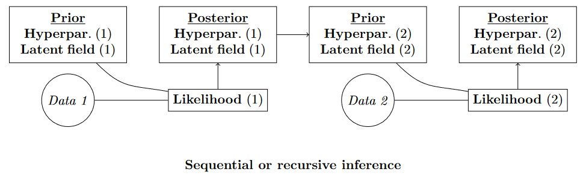{.absolute top="250" right="150" width="1000"}
:::

:::{.fragment .fade-in}
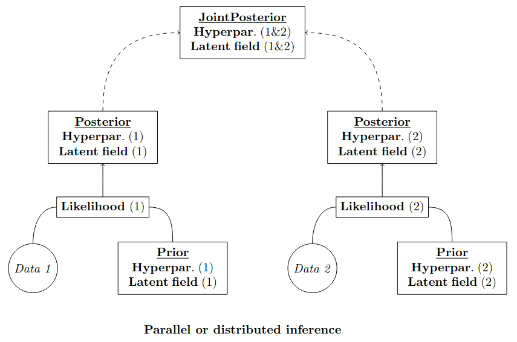{.absolute top="80" right="150" width="1000"}
:::

## Overview of both approaches {.smaller}

The strategies developed for both approaches are based on decomposing the inferential process into two main pieces: (i) obtaining an approximation to the joint marginal posterior distribution of the hyperparameters, together with an appropriate integration scheme, and (ii) estimating the posterior distribution of the latent field.

Specifically, the focus is on approximating the **joint marginal posterior of the hyperparameters**,
$$
\tilde{\pi}(\boldsymbol\theta \mid \mathbf{y}) \propto \left[\frac{\pi(\mathbf{y} \mid \mathbf{x}, \boldsymbol\theta) \pi(\mathbf{x} \mid \boldsymbol\theta) \pi(\boldsymbol\theta)}{\tilde{\pi}_G(\mathbf{x} \mid \boldsymbol\theta, \mathbf{y})}\right],
$$
from which an integration scheme is constructed to obtain the **marginal posterior distributions for each node of the latent field**,
$$
\tilde{\pi}(x_i \mid \mathbf{y}) = \sum_{k=1}^K \tilde{\pi}(x_i \mid \boldsymbol\theta^k, \mathbf{y}) \tilde{\pi}(\boldsymbol\theta^k \mid \mathbf{y})\Delta_k.
$$

To achieve this, it is necessary to define how to compute the **conditional posterior of the latent field** $\tilde{\pi}_G(\mathbf{x} \mid \boldsymbol\theta, \mathbf{y})$, in a distributed and recursive setting, as well as how to obtain its marginal distributions $\tilde{\pi}(x_i \mid \boldsymbol\theta, \mathbf{y})$. 

Once these components are available, a range of strategies can be employed to compute the **marginal posterior distributions of the hyperparameters** ($\pi(\boldsymbol\theta_j \mid \mathbf{y})$) and to derive appropriate **goodness-of-fit measures**.

## Distributed Inference

Following the same structure used to present the methodological details of INLA, we adopt this framework to describe the proposed approach for **distributed inference** based on **INLA**. In both frameworks, the aim is to perform inference in settings where the dataset is either naturally partitioned or deliberately split into multiple subsets $\mathbf{y} = \{\mathbf{y}_1, \dots, \mathbf{y}_n\}$. Accordingly, we examine the method in terms of the computation of:

- the conditional posterior of the latent field,
- the joint marginal posterior of the hyperparameters,
- the marginal posterior of the latent field, and
- the marginal posterior of the hyperparameters.

## {.smaller}
### Conditional posterior of the latent field 

To compute the conditional posterior of the latent field when the data have been partitioned, we can derive it from the general expression:
$$
\pi(\mathbf{x} \mid \boldsymbol\theta, \mathbf{y}) \propto \prod_{i=1}^n \left[ \pi(\mathbf{y}_i \mid \mathbf{x}, \boldsymbol\theta) \pi(\mathbf{x} \mid \boldsymbol\theta)^{w_i}\right] \propto \left(\prod_{i=1}^n \left[ \pi(\mathbf{y}_i \mid \mathbf{x}, \boldsymbol\theta) \pi(\mathbf{x} \mid \boldsymbol\theta)\right]\right)/\pi(\mathbf{x} \mid \boldsymbol\theta)^{n-1},
$$
where $\sum_{i=1}^n w_i = 1$ and $w_i>0$. This formula allow us to proposed two strategies to compute the conditional posterior: (i) scaling the prior distribution and (ii) the scaling the posterior.

In general, the expression to compute the conditional posterior distribution in a distributed framework is:
$$
\tilde{\pi}_d(\mathbf{x} \mid \boldsymbol\theta, \mathbf{y}) \propto \prod_{i=1}^n \tilde{\pi}_G(\mathbf{x} \mid \boldsymbol\theta, \mathbf{y}_i),
$$
where $\pi(\mathbf{x} \mid \boldsymbol\theta, \mathbf{y}_i)$ is the Gaussian approximation for the conditional posterior of the latent field for the i-th partition. Therefore, the conditional posterior under the distributed framework is also a Gaussian distribution with mean ($\boldsymbol\mu_d(\boldsymbol\theta)$) and precision matrix ($\mathbf{Q}_d(\boldsymbol\theta)$) defined as:
$$
\begin{array}{c}
\mathbf{Q}_d(\boldsymbol\theta) = \sum_{i=1}^n \mathbf{Q}_i(\boldsymbol\theta) = \sum_{i=1}^n \left[ w_i\mathbf{Q}(\boldsymbol\theta) - \mathbf{A}_i^\top \nabla_{\boldsymbol\eta_i}^2\pi(\mathbf{y}_i \mid \boldsymbol\eta_i, \boldsymbol\theta) \mathbf{A}_i  \right]_{\mathbf{\mathbf{x}=\mathbf{x}_i^*}}, \\
\boldsymbol\mu_d(\boldsymbol\theta) = \mathbf{Q}_d(\boldsymbol\theta)^{-1} \times \sum_{i=1}^n\mathbf{Q}_i(\boldsymbol\theta)\boldsymbol\mu_i(\boldsymbol\theta), \quad \boldsymbol\mu_i(\boldsymbol\theta) = \mathbf{x}_i^* = -\arg\min_{\mathbf{x}}\left\{ - \log\pi(\mathbf{y}_i \mid \mathbf{x}, \boldsymbol\theta) - w_i\log\pi(\mathbf{x} \mid \boldsymbol\theta) \right\}.
\end{array}
$$

## {.smaller}
### Joint marginal posterior of the hyperparameters

The joint marginal posterior of the hyperparameters, when the dataset is partitioned, can be computed as the product of the joint marginal posteriors of the hyperparameters obtained via the INLA method for each of the partitions. That is:
$$
\tilde{\pi}_{d}(\boldsymbol\theta \mid \mathbf{y}) \propto \prod_{i=1}^n \left[\frac{\pi(\mathbf{y}_i \mid \mathbf{x}, \boldsymbol\theta)\pi(\mathbf{x} \mid \boldsymbol\theta)\pi(\boldsymbol\theta)}{\tilde{\pi}_G(\mathbf{x} \mid \boldsymbol\theta, \mathbf{y}_i)}\right]_{\mathbf{x}=\mathbf{x}_i^*} = \prod_{i=1}^n \tilde{\pi}(\boldsymbol\theta \mid \mathbf{y}_i). 
$$
One of the main problems is on computing the distributed proposed joint marginal to lately defined the CCD scheme, or other scheme, for computing the marginals of the latent field, along with the marginal likelihood and other measures. In this sense, the proposal is to leverage the Gaussian approximation that is possible to compute for each partition and defined the joint maginal posterior as:
$$
\tilde{\pi}_{dG}(\boldsymbol\theta \mid \mathbf{y}) \propto \prod_{i=1}^n \tilde{\pi}_G(\boldsymbol\theta \mid \mathbf{y}_i).
$$
From this estimation we have an approximate posterior density for the hyperparameters (in their internal parametrization) that allow us to build a integration scheme, like the CCD. Therefore, once we have the integration scheme leveraging the Gaussian approximation we can use the former formula to compute the joint marginal posterior of the hyperparameters in the support points (integration points) for the marginal posterior of the laten field nodes. 

## {.smaller}
### Marginal posterior of the latent field

In the computation of the marginal posterior for each node of the latent field we leverage the formula used in the INLA method:
$$
\tilde{\pi}(x_i \mid \mathbf{y}) = \sum_{k=1}^K \tilde{\pi}(x_i \mid \boldsymbol\theta^k, \mathbf{y}) \tilde{\pi}(\boldsymbol\theta^k \mid \mathbf{y}) \Delta_k,
$$
where we apply a numerical integration approach using the integration scheme fixing a set of support points $\{\boldsymbol\theta^k\}_{k=1}^K$, $\tilde{\pi}(x_i \mid \boldsymbol\theta^k, \mathbf{y})$ and $\tilde{\pi}(\boldsymbol\theta^k \mid \mathbf{y})$ are the marginal of the conditional of the latent field and the joint marginal of the hyperparatmers at the support points, and $\Delta_k$ are the weights for each support point.

This expression can be easily rewritten, in a strightforward manner, for the distributed approach as:
$$
\tilde{\pi}_d(x_i \mid \mathbf{y}) = \sum_{k=1}^K \tilde{\pi}_d(x_i \mid \boldsymbol\theta^k, \mathbf{y}) \tilde{\pi}_d(\boldsymbol\theta^k \mid \mathbf{y}) \Delta_k,
$$
where the $\Delta_k$ quantity is compute, and generally can be computed, in the same way as in the standard INLA approach, $\tilde{\pi}_d(\boldsymbol\theta^k \mid \mathbf{y})$ is the marginal computed in the distributed proposal previously explained and $\tilde{\pi}_d(x_i \mid \boldsymbol\theta^k, \mathbf{y})$ is the marginal of the conditional posterior of the latent field for each node. This later quantity is the only that we need to compute now to perform the calculus of the marginal for each node. 

## {.smaller}

### Marginal posterior hyperparameters

The marginal posterior of the hyperparameters can be computed following the same strategies as in the based INLA method:

  - Marginalized a Gaussian approximation around the mode of the joint marginal posterior.
  - Numerical integration using a exploration grid and interpolation: (i) direct interpolation, or (ii) interpolation using an asymmetric Gaussian apprximation.
  - Numerical integration-free algorithm (default in `R-INLA`).

In this setting, the distributed expression for the joint marginal posterior of the hyperparameters must be used as the basis for deriving the marginal posterior of each hyperparameter:
$$
\tilde{\pi}_d(\boldsymbol\theta \mid \mathbf{y}) \propto \prod_{i=1}^n \tilde{\pi}(\boldsymbol\theta \mid \mathbf{y}_i).
$$

However, within a distributed framework, accurately computing marginal posterior distributions based on this expression is computationally demanding. This difficulty arises both from the numerical integration strategies required and from the additional computational burden imposed by distributed implementations of integration-free algorithms. Consequently, the simplest and most computationally efficient approach is to compute the marginal posteriors using the Gaussian approximation, $\pi_{dG}(\boldsymbol\theta \mid \mathbf{y})$.  

## Recursive Inference 

Following the structure used to present the methodological details of INLA, we describe the proposed recursive inference approach based on INLA, building on the distributed framework introduced above. The discussion therefore focuses on: 

- the **computation of the conditional posterior of the latent field** and 
- the **marginal posterior of the latent field**. 

The joint marginal and marginal posterior distributions of the hyperparameters are omitted, as they are obtained using the same strategies as in the distributed setting. Notably, any distributed framework can be applied recursively, allowing the distributed inference approach to be used directly for recursive inference.

## {.smaller}
### Conditional posterior latent field

To compute the conditional posterior of the latent field in a recursive setting, we exploit the fact that, once the set of support points is fixed, the computation can be carried out sequentially as
$$
\tilde{\pi}_r(\mathbf{x} \mid \boldsymbol\theta^k, \mathbf{y}_{1:i}) = \tilde{\pi}_G(\mathbf{x} \mid \boldsymbol\theta^k, \mathbf{y}_{1:i}).
$$
That is, at the $i$-th step, the Gaussian approximation to the conditional posterior is defined recursively. Consequently, the posterior distribution $\tilde{\pi}_r(\mathbf{x} \mid \boldsymbol\theta^k, \mathbf{y}_{1:i})$ is fully characterized by a mean vector $\mathbf{x}_{ir}(\boldsymbol\theta^k)$ and a precision matrix $\mathbf{Q}_{ir}(\boldsymbol\theta^k)$, given by
$$
\begin{array}{c}
\boldsymbol\mu_{ir}(\boldsymbol\theta^k) = \mathbf{x}^*_{ir} = -\arg\min_{\mathbf{x}}\{-\log\pi(\mathbf{y}_{i} \mid \mathbf{x}, \boldsymbol\theta^k) -\log\tilde{\pi}_{r}(\mathbf{x} \mid \boldsymbol\theta^k, \mathbf{y}_{1:(i-1)}) \} , \\
\mathbf{Q}_{ir}(\boldsymbol\theta^k) = \mathbf{Q}_{(i-1)r}(\boldsymbol\theta^k) - \left[\mathbf{A}^\top_i \nabla^2_{\boldsymbol\eta_i}\log\pi(\mathbf{y}_{i} \mid \boldsymbol\eta, \boldsymbol\theta^k) \mathbf{A}_i \right]_{\mathbf{x}=\mathbf{x}^*_{ir}}.
\end{array}
$$

Naturally, at the first step of the recursive algorithm, the prior distribution coincides with the standard prior used for the model, $\pi(\mathbf{x} \mid \boldsymbol\theta)$.

Under this procedure, it becomes evident that the proposed approach is, in general, not independent of the ordering adopted for the recursive inference.

## {.smaller}
### Marginal posterior of the latent field

The marginal posterior of the latent field is computed by directly applying one of the four standard INLA strategies:

- marginalizing the Gaussian approximation of the conditional posterior evaluated at the mode,
- applying a Laplace approximation independently for each node,
- using a simplified Laplace approximation based on a third-order Taylor expansion, or
- using the Gaussian approximation with a Variational Bayes (VB) correction to the mean.

Accordingly, the marginal posterior distributions within the recursive framework are obtained as
$$
\tilde{\pi}_r(x_i \mid \mathbf{y}_{1:i}) = \sum_{k=1}^K \tilde{\pi}_r(x_i \mid \boldsymbol\theta^k, \mathbf{y}_{1:i})\tilde{\pi}_r(\boldsymbol\theta^k \mid \mathbf{y}_{1:i})\Delta_k.
$$

A key feature of the recursive framework is that the marginal of the conditional posterior of the latent field $\tilde{\pi}(x_i \mid \boldsymbol\theta^k, \mathbf{y}_{1:i})$ can be computed using the standard INLA methodology without modification. The only difference from the base INLA approach is that, at each recursive step and for each support point $\boldsymbol\theta^k$, the prior distribution of the latent field is given by $\tilde{\pi}_G(\mathbf{x} \mid \boldsymbol\theta^k,  \mathbf{y}_{1:(i-1)})$.

## Differences and connections between distributed and recursive inference {.smaller}

The differences between the two approaches are numerous, as noted both at the beginning of this chapter and throughout its development. Among these, three fundamental connections can be highlighted:

- in both approaches, the *inference procedure* is **divided into two main pieces**;
- both employ exactly the same procedure to compute the **joint marginal and marginal posterior distributions of the hyperparameters**;
- since any distributed approach can be executed recursively, an equivalence can be established whereby the **order dependence of the recursive algorithm is eliminated**.

However, there are also substantial differences between the two procedures. In particular:

- the computation of the **conditional posterior of the latent field**, and consequently of the **marginal of the conditional posterior**, can be carried out differently;
- the resulting **marginal posterior distributions of the latent field nodes** differ between the two approaches.

## Partitioning model structures {.smaller}

In this case, the key condition imposed on the partitioning of the latent field—either in the distributed framework or along the sequence in the recursive framework—is that the resulting **prior distributions must be recoverable**. To achieve this, two strategies can be proposed, both **based on partitioning the precision matrix** of the prior distribution: (i) partitioning the latent field into diagonal blocks, which entails a loss of correlation information between blocks, or (ii) extending the diagonal blocks by scaling those elements that appear in multiple partitions.

Formally,
$$
\pi(\mathbf{x} \mid \boldsymbol\theta) = \prod_{i=1}^n\pi(\mathbf{x}_i \mid \boldsymbol\theta),
$$
where $\pi(\mathbf{x}_i \mid \boldsymbol\theta)=\text{MVN}(\boldsymbol\mu_i, \mathbf{Q}_i(\boldsymbol\theta))$. Consequently, we obtain
$$
\begin{array}{c}
\mathbf{Q}_p(\boldsymbol\theta) = \sum_{i=1}^n\mathbf{Q}_i(\boldsymbol\theta), \\
\boldsymbol\mu_p = \mathbf{Q}_p(\boldsymbol\theta)^{-1} \sum_{i=1}^n \mathbf{Q}_i(\boldsymbol\theta) \boldsymbol\mu_i.
\end{array}
$$

**This formulation** enables the construction of a distributed and recursive framework in which the **computational burden** associated with evaluating the posterior densities of the latent field **can be substantially reduced**, particularly for **spatial**, **temporal**, and especially **spatio-temporal models**.

---

## {.smaller}
### Partitioning algorithms

The fundamental basis for defining partitioning algorithms lies in the precision matrices associated with the selected components of the latent field to be partitioned—whether spatial, temporal, spatio-temporal, or otherwise. To this end, four algorithms are proposed for carrying out such partitions:

:::{.fragment .highlight-current-red fragment-index="1"}
:::{.fragment .semi-fade-out fragment-index="2"}
- **Partitioning by separators** (nested dissection),
:::
:::

:::{.fragment .fade-in-then-out fragment-index="1"}
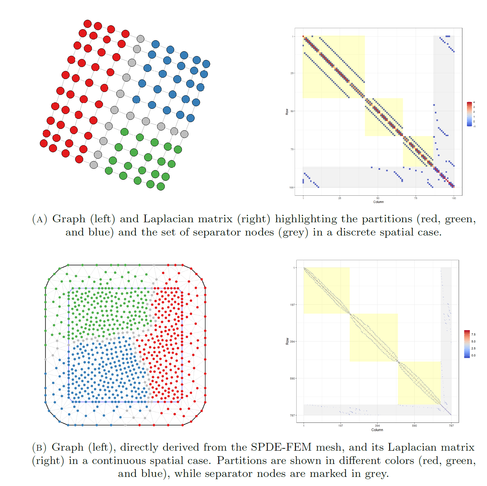{.absolute top="170" left="600" width="550"}
:::

:::{.fragment .highlight-current-red fragment-index="2"}
:::{.fragment .semi-fade-out fragment-index="3"}
- **Block-diagonal partitioning** (bandwidth reduction),
:::
:::

:::{.fragment .fade-in-then-out fragment-index="2"}
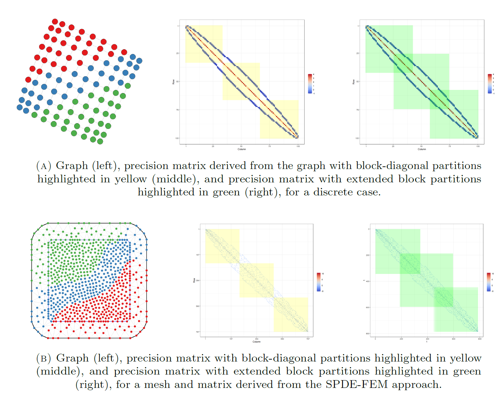{.absolute top="180" left="580" width="700"}
:::

:::{.fragment .highlight-current-red fragment-index="3"}
:::{.fragment .semi-fade-out fragment-index="4"}
- **Spectral clustering for graph partitioning**, and
:::
:::

:::{.fragment .fade-in-then-out fragment-index="3"}
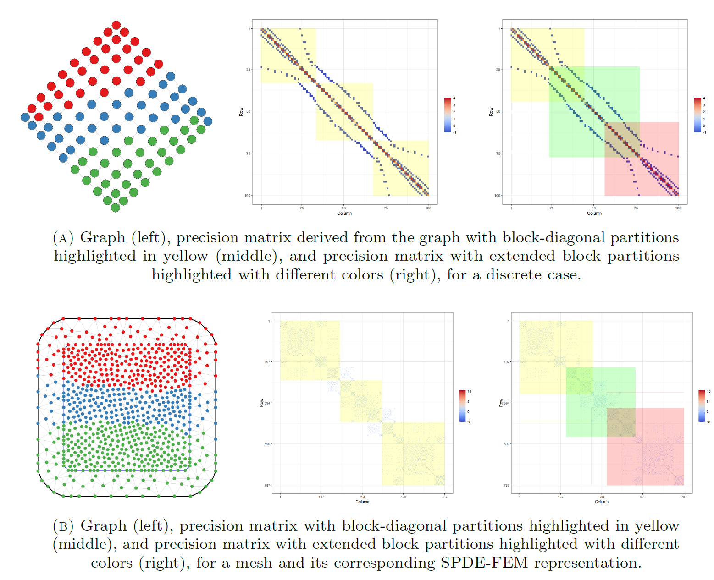{.absolute top="180" left="580" width="700"}
:::

:::{.fragment .highlight-current-red fragment-index="4"}
- **Block partitioning via Voronoi tessellation**.
:::

:::{.fragment .fade-in fragment-index="4"}
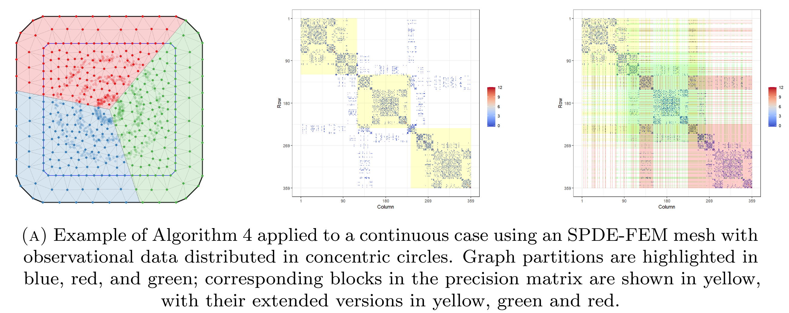{.absolute top="180" left="580" width="700"}
:::

# Examples

## Spatio-temporal model for temperature data {.smaller}

:::{.fragment .fade-out}
In this example, we consider a real example of temperature data, with $308$ spatial locations per temporal node, and $480$ temporal nodes. To performe the comparison with the standard full-data analysis we have chosen the first $120$ temporal nodes, as with the full dataset it ran out of memory. The model is a separable spatio-temporal model:
$$
\mathbf{y} = \text{vec}(1)\beta + \mathbf{A}\mathbf{u} + \boldsymbol\varepsilon,
$$
where $\mathbf{u} \sim \text{GMRF}(\mathbf{0}, \mathbf{Q}_{st})$, such that $\mathbf{Q}_{st}=\mathbf{Q}_t\otimes \mathbf{Q}_s$. The precision matrix is separble by the kronecker product in two components, a precision matrix related to a temporal **AR1** structure, and a precision matrix related to the classical (stationary and isotropic) **SPDE** precision matrix.
:::

:::{.fragment .fade-in-then-out}
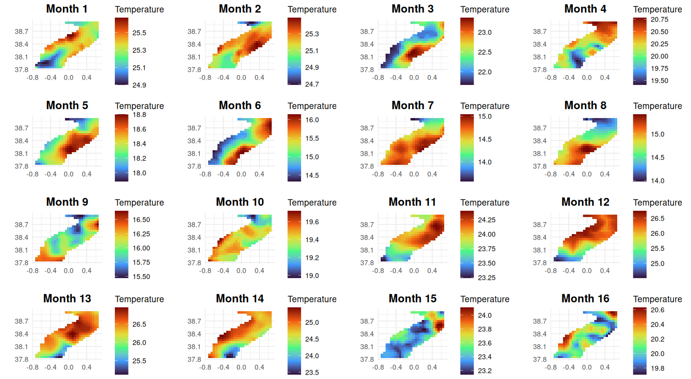{.absolute top="120" left="100" width="1000"}
:::

:::{.fragment .fade-in-then-out}
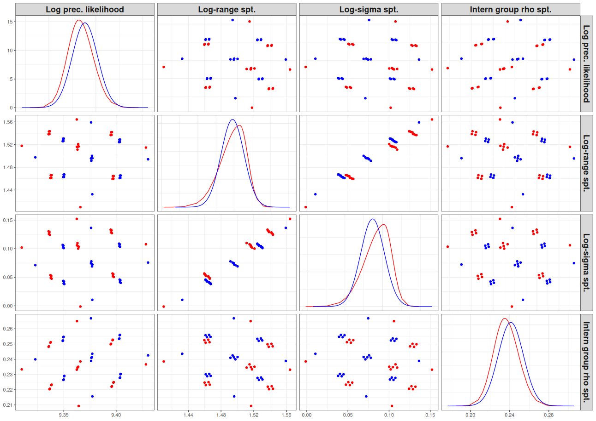{.absolute top="130" left="200" width="800"}
:::

:::{.fragment .fade-in-then-out}
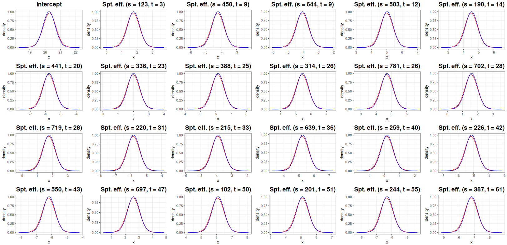{.absolute top="150" left="100" width="1000"}
:::

:::{.fragment .fade-in-then-out}
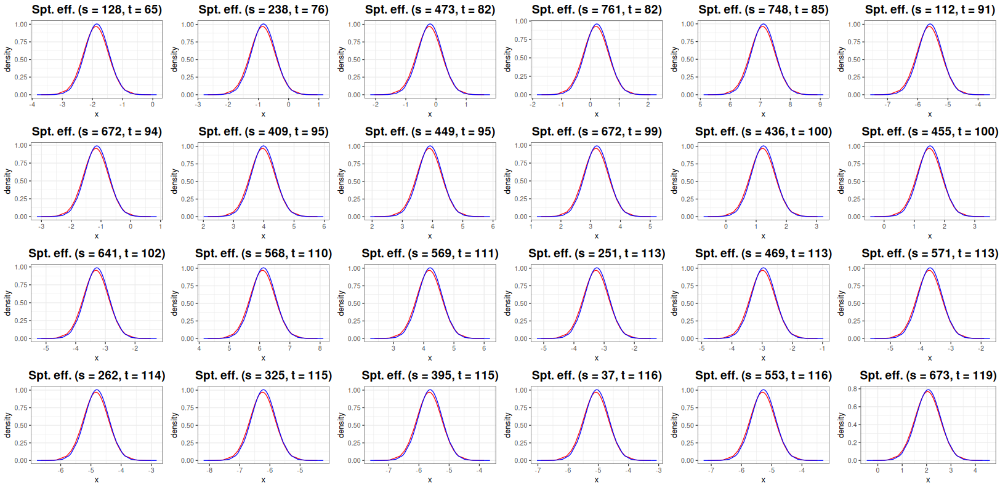{.absolute top="150" left="100" width="1000"}
:::

## Spatio-temporal downscaling model for CoDa {.smaller}

In this example, we consider a simulated dataset with **three categories** (corresponding to **two ALR components**) and a **spatio-temporal structure** that falls within a **Big Data setting** and exhibits **changes of spatial support over time**. The underlying model is defined through a **continuous Gaussian random field**, which is **integrated over space according to the spatial support associated with each temporal node**.
$$
\begin{array}{rcl}
\mu_{it1} = \beta_{01} + \int_{\mathbf{s}\in C_i}u_1(\mathbf{s},t)\text{d}\mathbf{s} + u_{it}, \\
\mu_{it2} = \beta_{02} + \int_{\mathbf{s}\in C_i}u_2(\mathbf{s},t)\text{d}\mathbf{s} + u_{it}. \\
\end{array}
$$

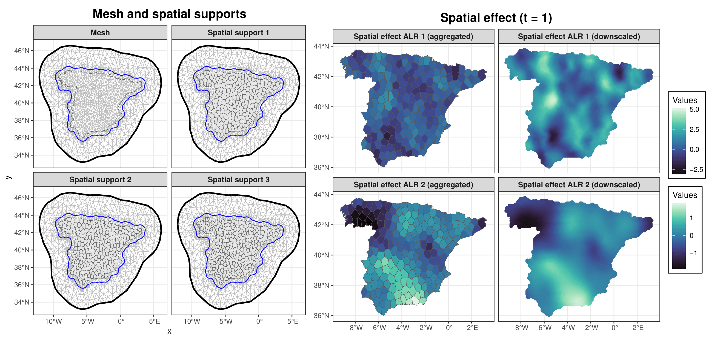{.absolute left="250" width="800"}

# Conclusions

## Conclusions {.smaller}

In this work, we develop **methodological frameworks for transferring information across inferential procedures using recursive (sequential) and distributed inference**. These frameworks apply to both partitioned and partially overlapping models with shared components. They enable **joint learning from multiple data sources** and offer **practical solutions to computationally intensive inference**, particularly in the presence of large datasets or complex model structures. The proposed approaches are especially suited to complex spatial and spatio-temporal models.

Specifically, this work:

- proposes **novel strategies and algorithms** for information updating, including recursive and distributed inference within the INLA framework;
- introduces **automatic procedures** for partitioning both data and underlying model structures; and
- addresses **computational challenges in spatial and spatio-temporal Big Data settings**, such as spatio-temporal models with change of support for compositional data (CoDa).

<!-- Along this work we have developed **methodological frameworks for transferring information across inferential procedures using recursive (or sequential) and distributed inference**, applicable to both partitioned and partially overlapping models that share common components. These approaches enable **joint learning from different sources** and **provide practical solutions for computationally intensive inference** arising from large datasets or complex model structures. Particurlarly, these frameworks can be widely applied to complex spatial and spatio-temporal models. -->

<!-- Specifically, this work: -->

<!-- - proposes **novel strategies and algorithms** for information updating, including **recursive and distributed inference frameworks** within the INLA method; -->
<!-- - introduces automatic procedures to partition data and the underlaying model structures; and -->
<!-- - addresses computational challenges in spatial and spatio-temporal in Big Data settings, e.g. spatio-temporal models with change of support for CoDa. -->
